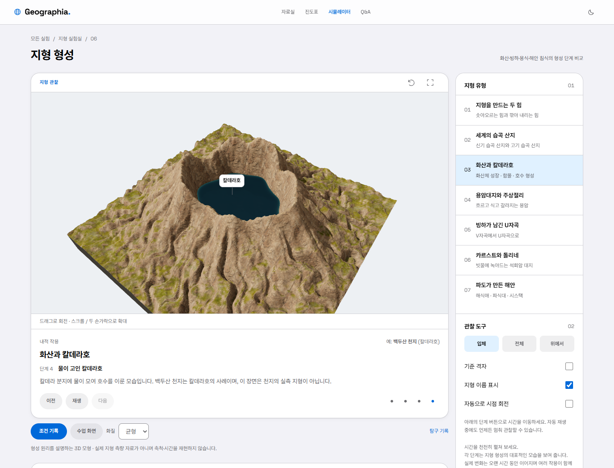
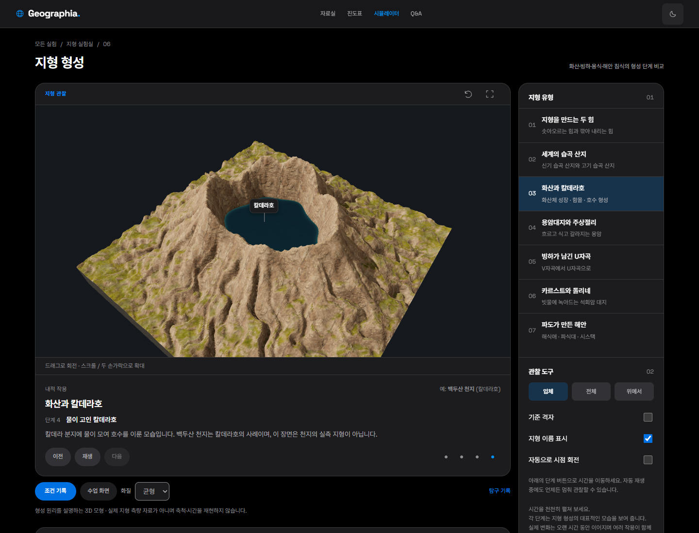

# 시뮬레이션 장면 개편 — 첫 화면 검토본

2026-10-04 · `world_landforms.html` · 모형 버전 `4.0.0-landforms`

## 범위와 확인 절차

이번 요청은 시뮬레이션 장면의 현실감·가독성 개선과 사용자가 제공한 `DESIGN_GUIDE.md`의 페이지 디자인 적용이다. 해당 가이드 §10의 “큰 변경은 한 화면만 먼저 만들어 보여 주고, 확인받은 뒤 나머지를 진행한다”에 따라 지형 형성 페이지를 먼저 제작했다. 나머지 페이지의 장면·전체 디자인 개편은 이 기준안 확인 후 진행한다. 공개 main과 홈페이지의 정비 안내는 그대로 유지한다.

7개 실험 화면을 살펴본 결과, 지형은 단순한 표면·고도 색띠·격자의 비중, 지구 장면은 관찰 대상 크기와 표식, 일사·수렴대는 도식의 깊이 표현, 서울은 지도 위 정보의 우선순위를 개선할 필요가 있었다. 첫 화면의 검토 대상은 지형 메시·재질·수면·조명·카메라·표식과 STRATUM UI다.

## 지형 장면

- 칼데라의 비대칭 윤곽, 사면의 방사형 골, 암석과 식생의 경사별 표현을 결정론적으로 생성한다. 측량 자료를 사용한 특정 장소의 재현은 아니다.
- 지형은 256×256개 셀이다. 화면의 높이와 단면 계산은 같은 높이 함수와 미세 지형 함수를 사용한다. 질감 셰이더는 표면을 이동시키지 않는다.
- 호수 수면은 수평이며 지형과 만나는 선에서 삼각형을 잘라 낸다. 칼데라 바깥의 낮은 사면은 호수로 채우지 않는다. 수면 광택과 미세 법선은 시각 표현이며 유체 역학 계산이나 풍속 자료가 아니다.
- 얇은 평면 대신 측면이 있는 잘라 낸 지형 모형을 사용한다. 측면 색은 기반 암석의 시각 표현이며 실제 지층의 순서·두께를 주장하지 않는다.
- 주상절리의 육각 기둥은 서로 겹치지 않는 배열을 사용한다. 냉각 수축과 이후 주변의 침식·노출을 설명한다. 실제 절리가 모두 육각형이라는 뜻은 아니다.
- 해식 노치는 하나의 높이만 표현하는 heightfield로 만들 수 없는 오버행을 별도 메시로 표현한다. 단면 그래프에는 지표 상단 높이만 표시하므로 노치 안쪽 벽은 포함하지 않는다. 파식대는 관찰을 위한 낮은 수위 조건이다.
- 습곡 산지의 침식 단계는 같은 위치의 산지를 낮춘다. 연대만으로 산지의 높이가 결정된다는 오해를 피하도록 설명을 보강한다.
- 명칭 표식의 겹침을 피하고, 입체/전체/위에서 보기와 화면에 맞추기를 제공한다. 기준 격자는 기본적으로 숨긴다.

## 그래픽 보강 — 2차 검토본

첫 화면의 칼데라에 사진 기반 암석·지표 재질을 적용했다. 암벽의 급경사 면은 삼방향 투영으로 늘어짐을 줄이고, 경사와 높이에 따라 지표와 암반 재질을 연속적으로 섞는다. CC0 원본 4개(합계 약 2 MB)는 저장소에 포함한다. 출처와 저자는 [재질 안내](../assets/sim-textures/README.md)에 기록했다. 재질을 읽지 못하면 기존 절차적 재질로 돌아간다.

골짜기와 칼데라 안쪽의 가려짐은 8방향의 지형 높이를 표본 추출해 음영에 반영한다. 매 프레임이 아니라 단계를 바꿀 때 한 번 계산한다. 암석 요철 지도는 법선에만 영향을 주며 지형 측정값을 바꾸지 않는다. 수면 색은 모형 수심에 따라 얕은 부분과 깊은 부분을 구분하고, 반사와 잔물결은 시각 표현으로 사용한다. 광학 계수는 실제 호수의 관측 자료에 맞춘 값이 아니다.

칼데라 기본 시점을 가까이 잡고, 지형 모형의 경계까지 보는 ‘전체’ 시점을 추가했다. 사진 재질의 검토 대상은 현재 칼데라 화면이다. 다른 지형에는 각각의 암석·빙하·해안 특성에 맞는 후속 작업이 필요하다.

## 과학적 근거와 표현의 경계

칼데라는 마그마의 유출과 압력·지지력 감소에 따른 함몰로 설명한다. ‘완전히 빈 마그마방’이라는 단정은 제거했다. [USGS의 2018년 킬라우에아 함몰 설명](https://www.usgs.gov/observatories/hvo/news/changes-2018-kilauea-summit-caldera-collapse-and-refilling)을 참고했다.

주상절리는 냉각·수축 균열이며, 기둥의 방향과 형상은 냉각 조건에 영향을 받는다. 모형의 정육각 배열은 대표적인 패턴을 보여 주기 위한 단순화다. [USGS 냉각 이력과 주상절리](https://www.usgs.gov/observatories/hvo/news/volcano-watch-columnar-jointing-provides-clues-cooling-history-lava-flows), [USGS Devils Postpile의 다양한 다각형 단면](https://www.usgs.gov/volcanoes/long-valley-caldera/science/vertical-columns-volcanic-rock-devils-postpile-national)을 참고했다.

표면의 미세한 요철과 자연물 색은 현실감을 위한 절차적 표현이다. 절대 고도·기후대·암석 성분·실제 침식량을 추정하는 자료가 아니다. 공통 높이 계산과 수면 경계의 일관성을 검증했지만, 실제 지형과의 통계적 적합도를 검증한 것은 아니다.

## 페이지 디자인

새 UI는 가이드의 회색 바탕, 흰 패널, 파란 조작 요소, Space Grotesk·Pretendard, 헤어라인 행을 사용한다. 장식용 영문 히어로·색 배지·초록색 조작 패널을 제거한다. 자연물에 쓰는 암석·식생·수면 색은 데이터 장면의 재질이며 UI 액센트와 구분한다. 밝은/어두운 모드와 모바일을 지원한다.

디자인 토큰은 `assets/sim-stratum-tokens.css`, 컴포넌트는 `assets/sim-stratum.css`에 둔다. 이 스타일은 첫 검토 페이지에만 연결한다. 다른 페이지 변경 내역 중 자산 주소 변경은 공유 모듈의 내용 해시 갱신이다.

## 기록 호환성

지형 높이 함수가 달라졌으므로 기존 기록과 같은 모형 버전으로 가장하지 않는다. 해당 페이지의 모델 버전을 분리하고 새 저장 키를 사용한다. 이전 브라우저 기록을 덮어쓰지 않는다. 이전 버전 JSON은 오류 안내와 함께 거부한다. 다른 페이지의 모형 버전과 저장 키는 유지한다.

## 재현 확인

```text
node --test tests/simulator-landscape.test.mjs
node scripts/check-simulators.mjs
node scripts/check-landform-scene.mjs
npm test
```

마지막 장면 검사는 로컬 HTTP 서버를 요구한다. `SIM_URL`로 서버 주소, `SCENE_SCREENSHOTS`로 화면 저장 경로를 바꿀 수 있다. 기본 결과는 `.superpowers/scene-v4/scene-check.json`에 남는다. 화면의 미적 판단은 자동 검사로 대체하지 않고 사용자 확인을 받는다.

검증 결과: 전체 자동 테스트 207개 중 204개 통과, 기존 외부 에뮬레이터 관련 3개 건너뜀. 새 지형 검증 5개는 모두 통과했다. 8개 페이지의 조작·저장·복원과 WebGL 대체 보기 회귀 검사가 통과했다. 사진 재질 다운로드를 차단해도 기존 재질과 유한한 단면 값이 유지되는 것을 확인했다. 새 화면은 데스크톱 두 테마와 390px 모바일의 axe 검사에서 위반 0건, 320·390·768px에서 페이지 가로 넘침 0건이었다. 정지 및 화면 밖 상태의 1초간 렌더링 계수는 각각 0이었다. 이 수치는 실제 기기의 FPS나 학습 효과 측정이 아니다.

## 검토 화면





[모바일 화면](previews/landforms-mobile.png) · [위에서 본 지형](previews/landforms-top.png)
